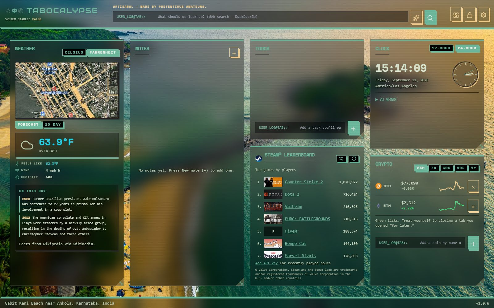

# Tabocalypse

**by AlienFacepalm**

Cross-browser new-tab extension (Chrome, Edge, Firefox, Safari): HUD widgets, humor packs, declarative plugins, and local-first settings. No publisher backend or telemetry.

Marketing homepage (static, buildless): [site/index.html](site/index.html) — see [site/README.md](site/README.md) to preview or deploy it.

<p align="center"></p>

> **Unreleased** — not on extension stores yet. Use a local build for testing; see [Try it locally](#try-it-locally) below.

## Try it locally

| If you…                                              | Start here                                                   |
| ---------------------------------------------------- | ------------------------------------------------------------ |
| Have the repo and want to build from source          | [doc/ALPHA-SETUP.md](doc/ALPHA-SETUP.md)                     |
| Already have a build folder or zip from someone else | [doc/INSTALL-LOCAL-TESTING.md](doc/INSTALL-LOCAL-TESTING.md) |
| Hit load or build errors                             | [doc/TROUBLESHOOTING.md](doc/TROUBLESHOOTING.md)             |

After **`pnpm build`**, load **`apps/extension/output/chrome_edge-mv3`** in Chromium via **Load unpacked**. Safari uses Apple’s converter on macOS — same doc set.

## Develop

Prerequisites: **Node 20+**, **pnpm**, a **git** clone (Husky pre-commit hooks).

```bash
pnpm install
pnpm dev          # Chrome (default)
pnpm dev:firefox
pnpm check        # format, lint, tests, typecheck
pnpm build        # chrome_edge-mv3, safari-mv3, firefox-mv2
```

Contributor workflow, env vars, and day-to-day commands: [doc/DEVELOPMENT.md](doc/DEVELOPMENT.md). PR expectations: [doc/CONTRIBUTING.md](doc/CONTRIBUTING.md).

## Monorepo layout

| Path                                                 | Purpose                                                                                 |
| ---------------------------------------------------- | --------------------------------------------------------------------------------------- |
| [`apps/extension`](apps/extension)                   | WXT browser extension (new tab app)                                                     |
| [`packages/plugin-sdk`](packages/plugin-sdk)         | `@tabocalypse/plugin-sdk` — declarative plugin types + validation                       |
| [`packages/example-plugin`](packages/example-plugin) | Sample `tabocalypse-plugin.json`                                                        |
| [`packages/projocalypse`](packages/projocalypse)     | Git submodule — roadmap PM board ([doc/PLAN/PROJOCALYPSE.md](doc/PLAN/PROJOCALYPSE.md)) |
| [`examples/`](examples)                              | Humor pack starter JSON                                                                 |
| [`site/`](site)                                      | Static marketing homepage and supporter page (outside the pnpm workspace)               |
| [`scripts/`](scripts)                                | Packaging, version bump, PM-board bridge, and documentation screenshot capture          |
| [`doc/`](doc)                                        | Guides, plans, [decision records](doc/ADR/README.md), and screenshots                   |

Pack and plugin formats: [doc/PLUGIN-SCHEMA.md](doc/PLUGIN-SCHEMA.md), [`examples/pack-starter.json`](examples/pack-starter.json).

**Optional build-time configuration** (`apps/extension/.env`, copy from [`.env.example`](apps/extension/.env.example)): footer support links (`WXT_TABOCALYPSE_SUPPORT_LINKS`), the Firefox add-on id (`WXT_TABOCALYPSE_FIREFOX_GECKO_ID`), an optional humor refresh feed, and the feedback mailto recipient. Details in [doc/DEVELOPMENT.md](doc/DEVELOPMENT.md#configuration). No secrets are ever required.

**Maintainers — roadmap PM board:** `pnpm pm:setup` then `pnpm pm:board` (port 5173). Sync plan checkboxes with `pnpm pm:sync`.

## Documentation

Index by audience: [doc/README.md](doc/README.md).

**Try it**

- [doc/ALPHA-SETUP.md](doc/ALPHA-SETUP.md) — clone, build, install in developer mode
- [doc/INSTALL-LOCAL-TESTING.md](doc/INSTALL-LOCAL-TESTING.md) — load unpacked without a dev setup
- [doc/TROUBLESHOOTING.md](doc/TROUBLESHOOTING.md) — common issues

**Develop**

- [doc/DEVELOPMENT.md](doc/DEVELOPMENT.md) — setup and commands
- [doc/CONTRIBUTING.md](doc/CONTRIBUTING.md) — PR workflow and checks
- [doc/ARCHITECTURE.md](doc/ARCHITECTURE.md) — packages, extension surfaces, and subsystems
- [doc/ADR/README.md](doc/ADR/README.md) — architecture decision records (why the constraints exist)
- [doc/PLUGIN-SCHEMA.md](doc/PLUGIN-SCHEMA.md) — declarative plugin JSON (v1)
- [doc/AGENT-INSTRUCTIONS.md](doc/AGENT-INSTRUCTIONS.md) — agent-agnostic rules ([AGENTS.md](AGENTS.md) for Cursor)
- [doc/AGENT-PARALLELISM.md](doc/AGENT-PARALLELISM.md) — avoid collisions when running multiple Cursor chats

**Ship prep** _(maintainers — pre-release)_

- [doc/PUBLISHING-EXTENSION-STORES.md](doc/PUBLISHING-EXTENSION-STORES.md) — Chrome, Edge, Firefox, Safari
- [doc/CROSS-BROWSER-PUBLISHING-PLAN.md](doc/CROSS-BROWSER-PUBLISHING-PLAN.md) — phased rollout
- [doc/PLAN/ROADMAP.md](doc/PLAN/ROADMAP.md) — future enhancements (candidate backlog)
- [doc/PLAN/MONETIZATION.md](doc/PLAN/MONETIZATION.md) — monetization spectrum, approved package, pricing, signed-JSON design
- [doc/PLAN/THEME-SUITES.md](doc/PLAN/THEME-SUITES.md) — sellable theme suites, brand kits for companies, theme pack schema and designer
- [doc/PLAN/MARKETING.md](doc/PLAN/MARKETING.md) — positioning, audiences, launch playbook, assets (screenshots via `pnpm screenshots:docs`)
- [doc/PLAN/PROJOCALYPSE.md](doc/PLAN/PROJOCALYPSE.md) — Projocalypse PM submodule and `pnpm pm:board`
- [doc/STORE-LISTING.md](doc/STORE-LISTING.md) — listing checklist
- [doc/GITHUB-ACTIONS.md](doc/GITHUB-ACTIONS.md) — CI and release packaging
- [doc/CHANGELOG.md](doc/CHANGELOG.md) — user-facing change summary
- [PRIVACY.md](PRIVACY.md) — privacy policy draft for store fields
