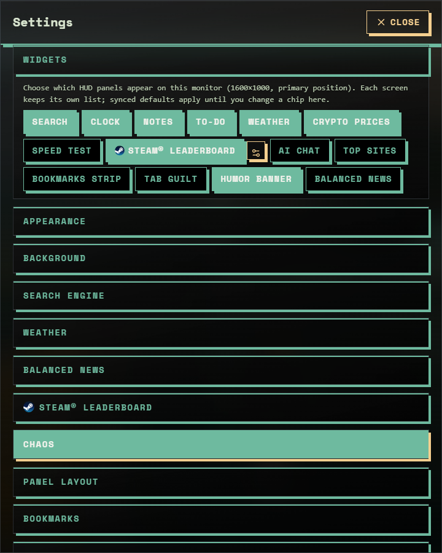
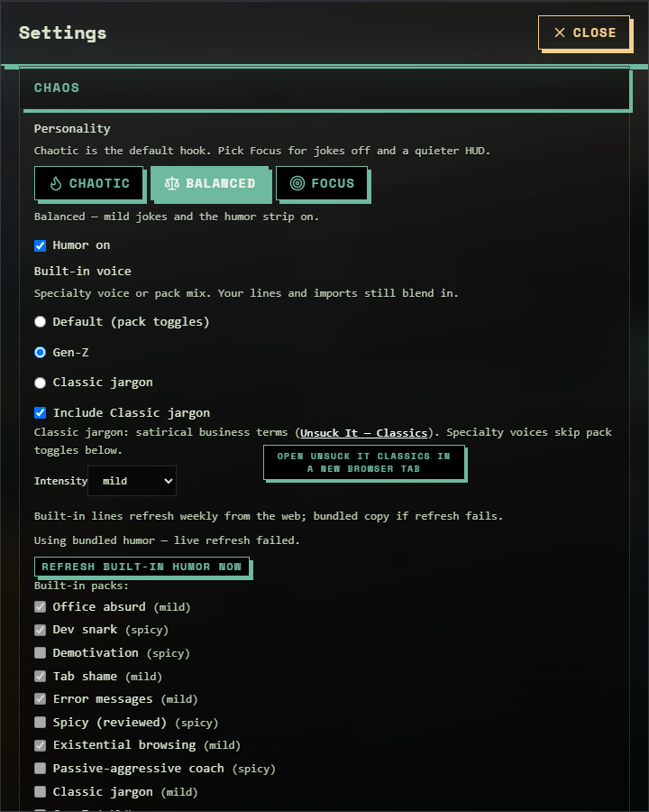

# Architecture overview

## High level

Tabocalypse is a **browser extension** that overrides the **new tab page** with a React UI: fourteen toggleable widgets (Search, Clock with alarms, Notes, To-do, Weather with a location map and the 2 Lakes buoy panel, Crypto prices, Speed test, Steam® leaderboard, AI chat, Top sites, Bookmarks strip, Tab guilt, Humor banner, Balanced news) plus a Plugin deck for imported declarative plugins; settings persisted in **`browser.storage`**; and an MV3 **service worker** that owns alarms and notifications, proxies allowlisted network fetches, and caches CoinGecko market rows.

There is **no publisher-operated backend** for core features; optional network use is **user-directed** (public endpoints for the widgets you enable, user URLs in plugins, a BYO AI base URL for settings tests and the optional AI chat widget). See [project conventions](../.cursor/rules/project-conventions.mdc) and the decision records in [`ADR/`](ADR/README.md).

## Packages

| Package                           | Responsibility                                                                                                  |
| --------------------------------- | --------------------------------------------------------------------------------------------------------------- |
| **`apps/extension`**              | WXT build, React new tab, `background.ts`, manifest, Tailwind-first UI                                          |
| **`@tabocalypse/plugin-sdk`**     | Shared types and `validatePluginJsonText()` — safe to unit test on Node                                         |
| **`@tabocalypse/example-plugin`** | Authoring sample only (published as workspace package, not shipped as a separate npm product unless you choose) |

## Extension surfaces (WXT)

Typical layout under [`apps/extension/entrypoints/`](../apps/extension/entrypoints/):

- **`newtab/`** — New tab page (main user interface). `main.tsx` loads settings and applies the theme to `<html>` **before** React mounts (no flash of the wrong palette), then lazy-loads `app.tsx`, which hosts the HUD canvas, every panel, and the Settings dialog.
- **`background.ts`** — MV3 service worker: alarm scheduling and OS notifications (`lib/tabocalypse-alarm-*.ts`), the **privileged fetch proxy** (`lib/privileged-extension-fetch-handler.ts`, HTTPS + host allowlist, redirect re-check, trusted-sender check), and the CoinGecko market-row cache with `Retry-After` handling.

Generated types and dev cache live under **`.wxt/`** (gitignored); shipped browser folders (**`chrome_edge-mv3`**, **`safari-mv3`**, **`firefox-mv2`**) are built under **`apps/extension/output/`** (gitignored). **Safari** App Store packaging still uses Apple’s **Safari Web Extension** tools on macOS from the **`safari-mv3`** (or **`chrome_edge-mv3`**) folder. Do not edit generated files by hand.

## Data flow (simplified)

1. **Settings** — Read/write only through `loadSettings` / `saveSettings` in [`lib/settings.ts`](../apps/extension/lib/settings.ts). Preferences live in a **sync slice** (`tabocalypseSync`, mirrored locally as `tabocalypseSyncMirror` and merged by `prefsSavedAt`); device-only data (API keys, todos, wallpapers, imported content, per-monitor layout) lives in the **local slice** (`tabocalypseLocal`); each note is its own sync item (`tabocalypseNote:<id>`) so the ~8 KB per-item quota applies per note. Writes are diffed and coalesced (250 ms) and flushed on tab hide. Export (`settings-export.ts`) redacts API keys and the Steam ID; import (`settings-import-secrets.ts`) never wipes saved keys with blanks; `merge-hydrated-settings.ts` protects in-flight edits when another tab writes. See [ADR-0008](ADR/ADR-0008-SETTINGS-PERSISTENCE-SYNC-AND-LOCAL.md).
2. **User packs / plugins** — Imported as files or JSON, validated with **`@tabocalypse/plugin-sdk`**, re-validated on every load (`lib/plugin-import.ts` drops malformed widgets), stored locally.
3. **Geo-based HUD panels** — One saved latitude/longitude in settings (edited under **Settings > Weather**) drives Weather forecast, Clock local time/timezone (via Open-Meteo), Balanced News device region, and related panels. Optional browser geolocation fills those coordinates when the user opts in. The Weather panel also shows a hybrid satellite **location map** (Yandex Static Maps, image only) with a HUD pin centered on those coordinates; tile size follows panel width and **recalibrates when you move the window between monitors** (same display fingerprint as per-monitor HUD layout). Map pan/zoom is stored **locally per monitor** on this computer (not synced), so each screen keeps its own camera while the shared pin stays the forecast anchor.
4. **Crypto prices** — Fetches public USD market samples from **CoinGecko** for the user's watchlist (default **BTC** and **ETH**, up to eight coins, synced) when that widget is enabled (no shipped API key).
5. **Every other data widget** (Steam Charts, Balanced news, Speed test, Bing wallpaper feed, humor refresh, Wikipedia trivia) calls its public endpoint through the background **privileged fetch** proxy; the host must be in `PRIVILEGED_EXTENSION_FETCH_ALLOWED_HOSTS` **and** in the manifest `host_permissions` ([ADR-0009](ADR/ADR-0009-PRIVILEGED-FETCH-HOST-ALLOWLIST.md)). Successful responses are cached locally per widget so an outage shows the last saved data with a "saved / not live" notice.

## Subsystems under `apps/extension/lib`

| Area                   | Modules                                                                                                                                    | Notes                                                                                                                                                                                                                                                                                   |
| ---------------------- | ------------------------------------------------------------------------------------------------------------------------------------------ | --------------------------------------------------------------------------------------------------------------------------------------------------------------------------------------------------------------------------------------------------------------------------------------- |
| HUD layout             | `hud-layout.ts`, `hud-auto-layout.ts`, `components/draggable-hud-panel.tsx`, `hud-canvas-grid.tsx`                                         | 12-column canvas, snap-to-grid drag and corner resize, auto repack (**Rearrange / F10**), per-monitor positions keyed by a display fingerprint, lock mode                                                                                                                               |
| Theme                  | `theme.ts`, `extract-wallpaper-accents.ts`, `entrypoints/newtab/tailwind.css`                                                              | Dark/Light, 10 accent palettes + custom pair, **Auto HUD** wallpaper sampling, control shape (Sharp / Soft / Pill) as CSS variables ([ADR-0007](ADR/ADR-0007-DESIGN-MD-SOURCE-OF-TRUTH.md))                                                                                             |
| Personality and humor  | `humor/*`, `settings.ts` (`applyPreset`), `components/system-status-tagline.tsx`                                                           | Chaotic / Balanced / Focus presets drive humor intensity, the status line, and layout style; built-in packs plus user packs; weekly refresh of the Unsuck-it classics                                                                                                                   |
| Geo                    | `hud-geo-location.ts`, `hud-geolocation.ts`, `resolve-timezone-from-coords.ts`, `weather/*`                                                | One shared latitude/longitude for Weather, Clock timezone, and news region ([ADR-0010](ADR/ADR-0010-SHARED-HUD-LOCATION-PER-MONITOR-LAYOUT.md)); Yandex static map with local per-monitor camera                                                                                        |
| Alarms                 | `tabocalypse-alarm-client.ts`, `-service.ts`, `-notification.ts`, `alarm-meta.ts`                                                          | UI sends `runtime.sendMessage`; the worker owns `browser.alarms` and shows OS notifications so reminders fire with no tab open                                                                                                                                                          |
| Credentials            | `settings-credential-field.ts`, `components/settings-credential-field.tsx`, `byo-ai-host-permission.ts`                                    | Masked inputs without `type=password`, paste handling, autofill suppression, optional host permission requested on save ([ADR-0003](ADR/ADR-0003-BRING-YOUR-OWN-AI-KEYS.md))                                                                                                            |
| Lists                  | `hud-virtual-window.ts`, `components/hud-virtual-list.tsx`, `steam-charts/steam-charts-virtual.ts`                                         | Virtualized, fill-to-height lists for Bookmarks and Steam leaderboard                                                                                                                                                                                                                   |
| Feedback and changelog | `feedback/*`, `changelog/changelog.generated.ts`, `scripts/generate-settings-changelog.ts`                                                 | mailto-only feedback ([ADR-0011](ADR/ADR-0011-FEEDBACK-VIA-MAILTO-ONLY.md)); `doc/CHANGELOG.md` embedded under Settings › Changelog ([ADR-0012](ADR/ADR-0012-CURATED-CHANGELOG-AND-DOC-LAYOUT.md))                                                                                      |
| Feature flags          | `feature-flags.ts`                                                                                                                         | Settings › Experimental opt-ins (currently the Weather HUD streak & points)                                                                                                                                                                                                             |
| Quiz, XP, rewards      | `local-iso-date.ts`, `quiz/*`, `xp/*`, `rewards/*`, `components/built-in/daily-quiz-widget.tsx`, `components/rewards-settings-section.tsx` | Date-seeded daily pick from a bundled question bank; device-local XP ledger and streak in standalone `storage.local` keys (`tabocalypseXpLedger`, `tabocalypseDailyQuizProgress`); rewards are bundled v1 plugins installed through `importedPlugins` — a game gate, not an entitlement |

## Settings dialog

One dialog, twenty collapsible sections in this order: Widgets (per monitor), Appearance, Background, Search engine, Weather, Balanced news, Steam® leaderboard, Chaos, Panel layout, Bookmarks, Optional permissions, BYO AI, Import pack, Import declarative plugin, Manage imports, Data (export / import JSON), Experimental, Changelog, Feedback & Feature Requests. HUD errors deep-link into the relevant section.

| Widgets (per monitor)                                          | Chaos (personality)                                        |
| -------------------------------------------------------------- | ---------------------------------------------------------- |
|  |  |

## Search widget (web vs assist)

The HUD **search** field has two actions: classic **web search** on the selected engine, and an optional **assist** action that opens a third-party AI / chat surface in a **new tab** (for example **Bing Copilot Search** (`/copilotsearch`), Google AI in Search, or Duck.ai via DuckDuckGo handoff).

- Tabocalypse does **not** fetch or render those answers inside the new tab page and does **not** use **publisher API keys** or a **backend** for this feature — it only opens HTTPS URLs with the query encoded, using the user’s normal browser session on the vendor site.
- Prompt prefill, login requirements, regional availability, and UI changes are entirely up to the third party and may shift without notice.

## Further reading

- [Development](DEVELOPMENT.md) — commands and load-unpacked paths
- [Plugin schema](PLUGIN-SCHEMA.md) — declarative plugin JSON
- [Architecture decision records](ADR/README.md) — the reasoning behind each constraint above
