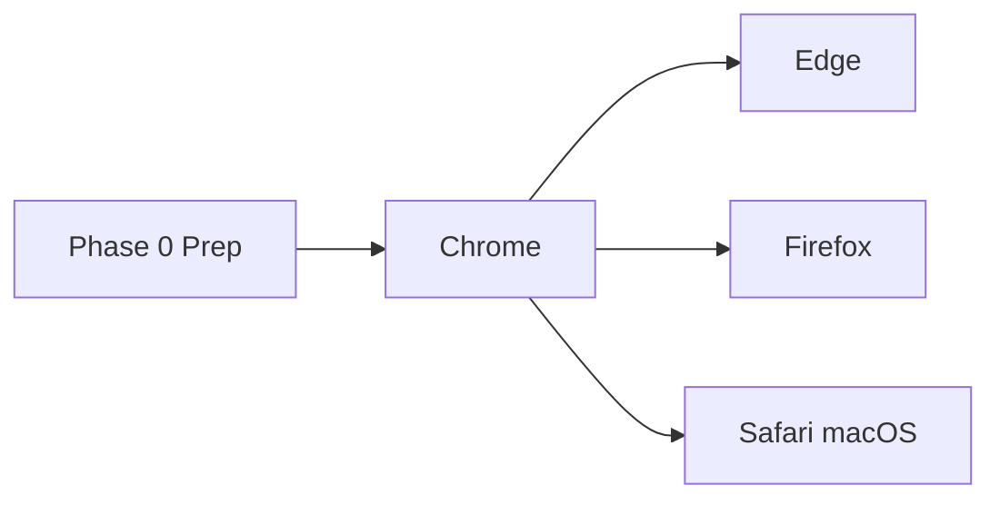

# Cross-browser publishing plan (Tabocalypse)

Step-by-step plan to ship Tabocalypse to **Chrome Web Store**, **Microsoft Edge Add-ons**, **Firefox Add-ons (AMO)**, and **Safari (Mac App Store)**. This document reviews a generic MV3 blueprint against **this repo’s actual tooling**, lists corrections, and defines the deliverables you need before any upload.

**Related docs:** [PUBLISHING-EXTENSION-STORES.md](PUBLISHING-EXTENSION-STORES.md) (store portals and policy), [STORE-LISTING.md](STORE-LISTING.md) (listing copy checklist), [PRIVACY.md](../PRIVACY.md) (privacy source of truth), [INSTALL-LOCAL-TESTING.md](INSTALL-LOCAL-TESTING.md) (Safari converter steps).

---

## How this repo differs from a generic blueprint

| Generic advice                                   | Tabocalypse reality                                                                                      |
| ------------------------------------------------ | -------------------------------------------------------------------------------------------------------- |
| Separate `/dist-chrome`, `/dist-firefox` folders | WXT writes **`apps/extension/output/`**: `chrome_edge-mv3`, `safari-mv3`, `firefox-mv2`                  |
| One MV3 build for all browsers                   | **Chrome, Edge, Safari = MV3.** **Firefox = MV2** (WXT default for `-b firefox`; AMO still accepts this) |
| Add `webextension-polyfill`                      | **Already used** (`webextension-polyfill` + `browser.*` imports)                                         |
| Zip the project directory                        | Zip the **built output folder** (or WXT zips); `manifest.json` must be at the **zip root**               |
| Firefox: upload source if minified               | Use **`wxt zip -b firefox --sources`** → `extension-*-sources.zip` for AMO                               |
| Safari: upload a zip                             | Safari needs **`safari-web-extension-converter`** on macOS → Xcode wrapper app → App Store Connect       |
| Start with Chrome                                | **Correct** — fix Chromium MV3 policy and permissions first; Edge reuses the same package                |

---

## Phase 0 — Prepare the extension core (all stores)

Do this once before opening any developer dashboard.

### 0.1 Version and quality gate

1. Set the release version in [`apps/extension/package.json`](../apps/extension/package.json) (WXT reads this for `manifest.version`).
2. From repo root:

   ```bash
   pnpm check
   pnpm build
   ```

3. Smoke-test **Load unpacked** from `apps/extension/output/chrome_edge-mv3` (Chrome/Edge) and temporary load for Firefox (`firefox-mv2`).

### 0.2 Generate store packages

From repo root:

```bash
pnpm package:stores
```

This runs `pnpm build`, creates WXT zips for Chromium and Firefox (+ Firefox sources), and writes a deliverables manifest under `apps/extension/output/store-deliverables/`. See [Deliverables matrix](#deliverables-matrix).

### 0.3 Firefox add-on ID (blocker for AMO)

Replace the placeholder Gecko ID before Firefox submit. Set in `apps/extension/.env`:

```env
WXT_TABOCALYPSE_FIREFOX_GECKO_ID=tabocalypse@yourdomain.com
```

Rebuild after changing it. AMO requires a **unique** reverse-domain ID tied to your Mozilla account.

### 0.4 Legal and marketing assets (blockers for all stores)

| Item                          | Status in repo                                       | Action before submit                                                                                                                                                                               |
| ----------------------------- | ---------------------------------------------------- | -------------------------------------------------------------------------------------------------------------------------------------------------------------------------------------------------- |
| **Privacy policy URL**        | [`PRIVACY.md`](../PRIVACY.md) in repo                | Host at a **public HTTPS URL** (GitHub default branch link, GitHub Pages, or your site). Stores reject “file in zip only”.                                                                         |
| **Support URL**               | Optional env links                                   | Add a support/contact URL (GitHub Issues is fine).                                                                                                                                                 |
| **Icons**                     | `public/icon/*.png`, WXT auto-icons                  | Confirm **128×128** (and store-required sizes) look correct in built output.                                                                                                                       |
| **Screenshots**               | Not in repo                                          | Capture per [STORE-LISTING.md](STORE-LISTING.md): default new tab, Settings (widgets), import/BYO AI disclaimer. Typical sizes: **1280×800** and/or **440×280** (check each store’s current spec). |
| **Short + long description**  | Partial in manifest                                  | Expand for each dashboard; emphasize **new tab replacement**, **no publisher backend**, **local/BYO data**.                                                                                        |
| **Permission justifications** | See [wxt.config.ts](../apps/extension/wxt.config.ts) | Pre-write reviewer notes for optional `bookmarks`, `topSites`, `tabs`, and OpenAI-compatible host.                                                                                                 |

### 0.5 Permission summary (for store forms)

Copy from [`wxt.config.ts`](../apps/extension/wxt.config.ts) and [PRIVACY.md](../PRIVACY.md):

- **Required:** `storage`, `alarms`, `notifications`
- **Optional (user enables widgets):** `bookmarks`, `topSites`, `tabs`
- **Host permissions:** Open-Meteo, CoinGecko, Cloudflare speed test, Peapix/Bing imagery, King County lake buoys
- **Optional host:** user-configured OpenAI-compatible API (BYO key test only)
- **No** remote code execution; declarative plugins are **JSON only**

---

## Phase 1 — Google Chrome Web Store (start here)

**Why first:** Strictest automated MV3 checks; a green Chrome build ports cleanly to Edge and Safari MV3.

|            |                                                                                                               |
| ---------- | ------------------------------------------------------------------------------------------------------------- |
| **Portal** | [Chrome Developer Dashboard](https://chrome.google.com/webstore/devconsole)                                   |
| **Cost**   | One-time **$5 USD** registration                                                                              |
| **Upload** | `apps/extension/output/store-deliverables/tabocalypse-{version}-chrome.zip` (or WXT `extension-*-chrome.zip`) |
| **Review** | Often **1–3 days**; longer if broad host permissions need justification                                       |

**Steps**

1. Pay developer registration; create publisher account.
2. **New item** → upload Chromium zip; confirm `manifest.json` at zip root.
3. Listing: title **Tabocalypse**, category **Productivity** (or Lifestyle — pick one and stay consistent).
4. **Privacy practices** questionnaire — align with [PRIVACY.md](../PRIVACY.md) (local storage, optional sync via browser, user-directed network only).
5. Declare **single purpose:** replaces the new tab page with widgets and optional humor/plugins.
6. Submit for review; respond to policy emails in the dashboard.

**Official:** [Chrome Web Store developer documentation](https://developer.chrome.com/docs/webstore)

---

## Phase 2 — Microsoft Edge Add-ons

|            |                                                                          |
| ---------- | ------------------------------------------------------------------------ |
| **Portal** | [Partner Center](https://partner.microsoft.com/dashboard) → Edge Add-ons |
| **Cost**   | **Free**                                                                 |
| **Upload** | **Same zip as Chrome** (Chromium MV3)                                    |
| **Review** | Often **1–4 business days**                                              |

**Steps**

1. Enroll with a Microsoft account.
2. Create Edge listing; upload **`tabocalypse-{version}-edge.zip`** (identical MV3 bytes to the Chrome zip; separate filename for Partner Center).
3. Complete Edge privacy/permissions questionnaire (same facts as Chrome).
4. Submit.

**Official:** [Publish to Microsoft Edge Add-ons](https://learn.microsoft.com/microsoft-edge/extensions-chromium/developer-guide/publish-extension)

---

## Phase 3 — Mozilla Firefox (AMO)

|            |                                                                                                                                                  |
| ---------- | ------------------------------------------------------------------------------------------------------------------------------------------------ |
| **Portal** | [Firefox Extension Workshop](https://extensionworkshop.com/documentation/publish/) / [AMO Developer Hub](https://addons.mozilla.org/developers/) |
| **Cost**   | **Free**                                                                                                                                         |
| **Upload** | `tabocalypse-{version}-firefox.zip` + **`tabocalypse-{version}-firefox-sources.zip`**                                                            |
| **Review** | Automated checks can be **hours**; manual review **days** if permissions are complex                                                             |

**Steps**

1. Set **`WXT_TABOCALYPSE_FIREFOX_GECKO_ID`** in `.env`; rebuild and re-run `pnpm package:stores`.
2. Create AMO listing (public on AMO recommended for discoverability).
3. Upload **built XPI/zip** and **sources zip** from `store-deliverables/`.
4. In review notes, include build steps:

   ```text
   pnpm install
   pnpm build
   pnpm package:stores
   ```

   Source: public Git repo URL. No obfuscation beyond standard Vite production minify.

5. Explain optional permissions and host access (weather, crypto, BYO AI, Bing background).

**Note:** Firefox build is **`firefox-mv2`** in this repo — not an error; document it for reviewers.

**Official:** [Distribute your extension](https://extensionworkshop.com/documentation/publish/)

---

## Phase 4 — Apple Safari (Mac App Store)

Safari is the outlier: no raw extension zip to the store.

|                  |                                                                                      |
| ---------------- | ------------------------------------------------------------------------------------ |
| **Portal**       | [Apple Developer Program](https://developer.apple.com/programs/) + App Store Connect |
| **Cost**         | **$99 USD / year**                                                                   |
| **Input folder** | `apps/extension/output/safari-mv3/` (from `pnpm build` or `pnpm build:safari`)       |
| **Review**       | Often **24–72 hours** (human testing)                                                |

**Steps (on macOS)**

1. Run `pnpm build:safari` (or full `pnpm build`).
2. Convert to Xcode project:

   ```bash
   xcrun safari-web-extension-converter /path/to/tabocalypse/apps/extension/output/safari-mv3
   ```

3. Open the generated macOS app in **Xcode**; set bundle ID, signing team, and extension target.
4. **Archive** → **Distribute** → App Store Connect.
5. App Store Connect listing: describe the **Safari Web Extension** embedded in the wrapper app; link the same privacy policy URL.

**Official:** [Safari Web Extensions](https://developer.apple.com/safari/extensions/)

---

## Recommended rollout order



1. **Phase 0** — check, build, package, privacy URL, screenshots, Gecko ID
2. **Chrome** — fix any policy rejections
3. **Edge** — same artifact, parallel or immediately after Chrome approval
4. **Firefox** — sources zip + Gecko ID
5. **Safari** — when Mac + Apple Developer account ready

---

## Deliverables matrix

After `pnpm package:stores`:

| Deliverable                 | Path                                                           | Used for                                        |
| --------------------------- | -------------------------------------------------------------- | ----------------------------------------------- |
| Chromium store zip (Chrome) | `store-deliverables/tabocalypse-{version}-chrome.zip`          | Chrome Web Store                                |
| Chromium store zip (Edge)   | `store-deliverables/tabocalypse-{version}-edge.zip`            | Microsoft Edge Add-ons (same build as Chrome)   |
| Firefox build zip           | `store-deliverables/tabocalypse-{version}-firefox.zip`         | AMO upload                                      |
| Firefox sources zip         | `store-deliverables/tabocalypse-{version}-firefox-sources.zip` | AMO source review                               |
| Safari MV3 zip              | `store-deliverables/tabocalypse-{version}-safari-mv3.zip`      | Unzip on Mac → `safari-web-extension-converter` |
| Safari MV3 folder (local)   | `output/safari-mv3/`                                           | Same build as the Safari zip                    |
| Deliverables checklist      | `store-deliverables/DELIVERABLES.md`                           | Maintainer sign-off                             |
| Privacy policy              | **Hosted HTTPS URL**                                           | All store forms                                 |
| Screenshots                 | Your capture folder (not generated)                            | All listings                                    |

---

## Store listing copy (starter)

**Short description (≤132 chars):**  
Replace your new tab with widgets, humor packs, and optional imports — local-first, no publisher backend.

**Single purpose:**  
Tabocalypse overrides the new tab page to show clocks, weather, todos, notes, search, and optional humor or user-imported JSON packs. All core data stays on the device; network use is limited to features the user enables.

**Monetization:**  
Donate/support links open third-party sites only; the extension does not process payments.

Expand and localize per store in [STORE-LISTING.md](STORE-LISTING.md).

---

## After launch

- Bump version in `apps/extension/package.json` for each release; run `pnpm package:stores` again.
- Update [CHANGELOG.md](CHANGELOG.md) and store “What’s new” text.
- Keep [PRIVACY.md](../PRIVACY.md) and store disclosures in sync when permissions or network behavior changes.
- Monitor reviews and crash reports per store dashboard.

---

## Quick command reference

```bash
pnpm check              # format, lint, test, typecheck
pnpm build              # chrome_edge-mv3 + safari-mv3 + firefox-mv2
pnpm package:stores     # build + zips + DELIVERABLES.md
pnpm build:firefox      # Firefox only
pnpm build:safari       # Safari MV3 only
```
