# 📣 Tabocalypse marketing plan

**Status:** drafted 2026-09-11 alongside the monetization and theme-suite plans. Budget: **$0**. Team: one maintainer plus whoever shows up. No analytics, no ad spend, no deadlines — this is a **playbook**, not a calendar, in keeping with the no-scheduled-obligations rule ([ADR-0016](../ADR/ADR-0016-MONETIZATION-ONE-OFF-LINK-OUT-NO-ADS.md)).

---

## 🎯 1. Positioning

**One line:** _The new tab that respects you enough to insult you._

**Category:** new-tab replacement / personal dashboard extension (Chrome, Edge, Firefox, Safari).

**Position:** the **privacy-first, personality-forward** alternative to Momentum, Infinity, and Start.me. Same widgets people expect (clock, weather, notes, to-dos, search, crypto, news), with three things nobody else in the category ships together:

| 🧩 What                   | 💬 How we say it                                                                    | 🔒 Why it is defensible                                                                                                    |
| ------------------------- | ----------------------------------------------------------------------------------- | -------------------------------------------------------------------------------------------------------------------------- |
| No publisher backend      | "There is no server. We could not read your notes if we wanted to."                 | Structural ([ADR-0001](../ADR/ADR-0001-NO-PUBLISHER-BACKEND.md)); competitors run accounts and sync servers                |
| No ads, ever, from anyone | "No sponsored tiles. No affiliate 'Trade' buttons. Not from us, not from creators." | Product invariant and plugin content policy; a competitor cannot copy it without giving up revenue                         |
| Personality you can dial  | "Chaotic, Balanced, or Focus. Pick how rude your browser is today."                 | Glitch-core design ([ADR-0007](../ADR/ADR-0007-DESIGN-MD-SOURCE-OF-TRUTH.md)) plus humor packs are hard to fake tastefully |

**Proof points to repeat everywhere:** open source (AGPL), portable JSON settings, BYO AI keys only, declarative plugins (no user code), offline-verified purchases, one-off pricing.

### 💥 One-liner bank

- Your tabs just dropped a diss track about you.
- `SYSTEM_STABLE: FALSE` — and honestly, same.
- A dashboard with no account, no server, no sponsored tiles. Just widgets and attitude.
- Momentum without the motivational poster. Or the subscription.
- Bring your own API key. Bring your own bad decisions.
- Local-first, glitch-core, no ads. Not even from your plugins.

---

## 👥 2. Audiences

| Persona                         | 🧠 Wants                                                           | 😤 Hates                                          | 🎣 Where they are                                     | 🪝 Hook                                                                      |
| ------------------------------- | ------------------------------------------------------------------ | ------------------------------------------------- | ----------------------------------------------------- | ---------------------------------------------------------------------------- |
| 🧑‍💻 **Privacy-minded developer** | A useful new tab that does not phone home; something to hack on    | Accounts, telemetry, closed source                | GitHub, Hacker News, Lobsters, r/privacy, r/firefox   | "Read the manifest. Nineteen public hosts, zero of ours."                    |
| 🎮 **Gamer / Steam user**       | Live top-games board, Steam hours, crypto ticker, loud aesthetic   | Bland corporate UI                                | r/Steam, r/pcgaming, Steam community, Discord servers | Steam® leaderboard panel with capsule art; Chaotic mode                      |
| 📈 **Productivity tinkerer**    | Notes, to-dos, alarms, weather, focus mode, per-monitor layouts    | Paying monthly for a to-do list                   | r/productivity, Product Hunt, YouTube setup tours     | Focus preset + Sharp/Soft/Pill shapes + free forever                         |
| 🎨 **Theme and pack creator**   | A format they can sell without a store taking a cut                | Review queues, revenue share, sponsored placement | Gumroad/Ko-fi sellers, design Twitter/X, Dribbble     | Signed JSON, self-sold, we take nothing ([THEME-SUITES.md](THEME-SUITES.md)) |
| 🏢 **IT admin / small company** | A branded intranet start page deployed by policy, no SaaS per seat | Per-seat renewals, vendor lock-in                 | r/sysadmin, LinkedIn, MSP communities                 | One-time Brand Kit, managed storage deploy, AGPL escape hatch                |

Ordering matters: developers first (they write the reviews and stars that make the store listing credible), then gamers and tinkerers for volume, creators and companies once the theme engine and entitlements ship.

---

## 🧱 3. Messaging pillars with proof

<table>
<tr>
<td width="50%" valign="top">

### 🔒 Privacy by architecture

No AlienFacepalm backend. Preferences sync through the **browser vendor's** storage only; keys, todos, and wallpapers never leave the device. Feedback is a `mailto:`. Purchases (when they exist) are verified offline.

**Show:** the permission table in [`STORE-LISTING.md`](../STORE-LISTING.md), the [privacy policy](../../PRIVACY.md), the Optional permissions screen.

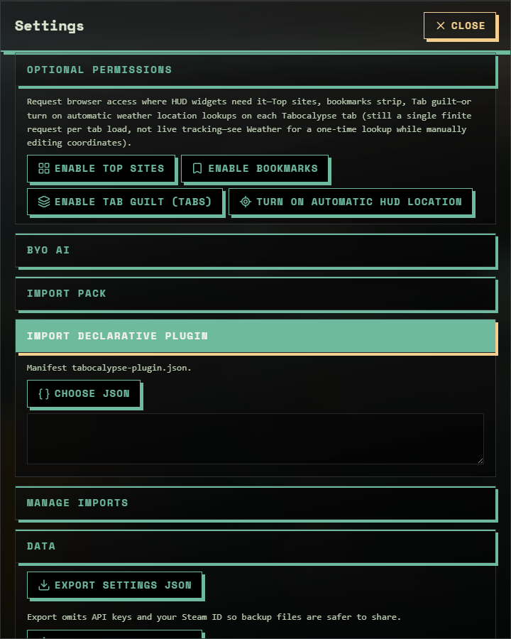

</td>
<td width="50%" valign="top">

### 🎛️ Personality you control

Three presets change layout style, humor intensity, and the status line. Focus mode is a real productivity mode, not a marketing checkbox.

**Show:** Chaos settings and the Focus HUD side by side.

</td>
</tr>
<tr>
<td width="50%" valign="top">

### 🧩 Widgets people actually use

Fourteen widgets, per-monitor toggles, draggable snap-to-grid panels, **Rearrange (F10)**, alarms that fire with no tab open.

</td>
<td width="50%" valign="top">

### 🎨 Looks like nothing else

Glitch-core terminal: hard shadows, scanlines, Space Mono. Auto HUD samples your wallpaper for accents. Dark and light. Theme suites coming as signed JSON.

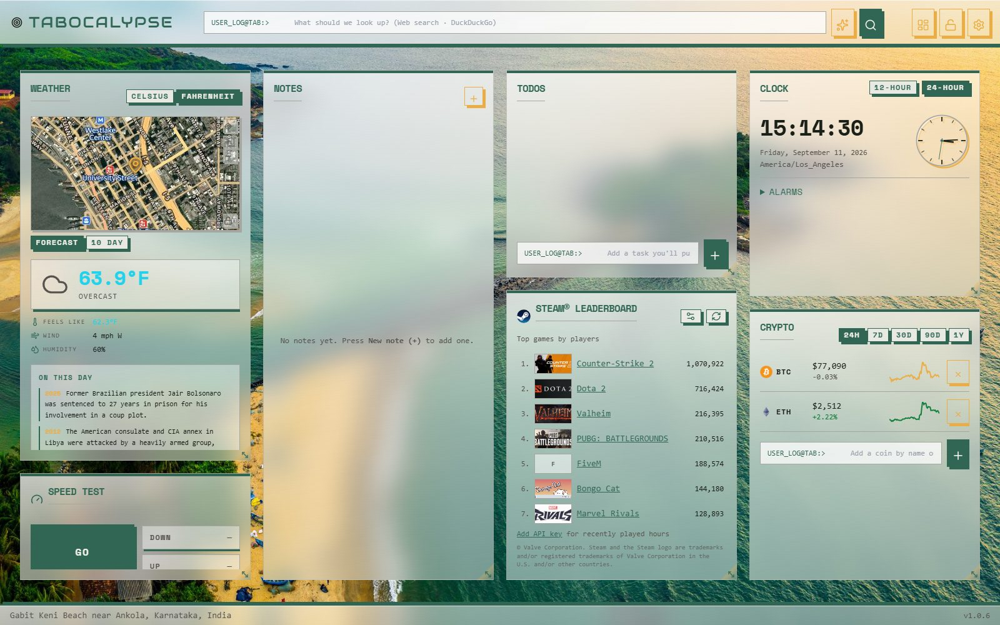

</td>
</tr>
</table>

---

## 🚫 4. Marketing rules (non-negotiable)

- **No ads in the product, ever** — and no marketing that implies otherwise (no "partner" tiles in screenshots, no affiliate links in posts).
- **No analytics** on the site or in the extension; do not add "just a pixel" for attribution ([ADR-0018](../ADR/ADR-0018-STATIC-MARKETING-SITE-ON-GITHUB-PAGES.md)).
- **No promised dates, roadmaps with quarters, or "coming next month".** Announce when shipped.
- **No fake social proof:** no purchased reviews, no astroturfed threads, no follower buys.
- **Real screenshots only** — every image is captured from a build by `pnpm screenshots:docs` ([ADR-0019](../ADR/ADR-0019-DOC-SCREENSHOTS-VIA-PLAYWRIGHT-SCRIPT.md)).
- **Trademarks:** Steam® and Valve attribution stays on the leaderboard; never use Momentum/Infinity logos; suite names avoid trademarks.
- **Tone:** sarcastic about the user's habits, never punching down; jokes ship in Balanced mode by default so a screenshot cannot embarrass a reviewer.

---

## 📡 5. Channels and tactics

| Channel                                                                                              | 🎯 Goal                          | ▶️ Tactic                                                                                                                                              | 📎 Asset                                                        |
| ---------------------------------------------------------------------------------------------------- | -------------------------------- | ------------------------------------------------------------------------------------------------------------------------------------------------------ | --------------------------------------------------------------- |
| 🏬 **Chrome Web Store** (then Edge, Firefox AMO, Safari)                                             | Discovery + trust                | Listing copy from [`STORE-LISTING.md`](../STORE-LISTING.md); five screenshots; "no publisher backend" in the first sentence; answer every review       | `hud-default.jpg`, `settings-*.png`, resized per portal         |
| 🐙 **GitHub**                                                                                        | Stars, contributors, credibility | README hero image, ADRs, good-first-issues, AGPL badge; pin the repo; release notes copied from the changelog                                          | `README.md`, `doc/ADR/`                                         |
| 🟠 **Hacker News — "Show HN"**                                                                       | Developer audience               | Title: _Show HN: Tabocalypse – a new-tab HUD with no backend, no ads, and a rude mode_. Post when the Chrome listing is live; be in the thread for 6 h | Link to store + repo; one GIF                                   |
| 👽 **Reddit** (r/chrome, r/firefox, r/privacy, r/Steam, r/productivity, r/unixporn-style setup subs) | Volume, feedback                 | One honest post per sub, tailored (privacy angle vs Steam angle vs setup-tour angle); never cross-post the same text; obey self-promo rules            | Per-sub screenshot (Focus for productivity, Chaotic for gaming) |
| 🚀 **Product Hunt**                                                                                  | Tinkerers, press                 | Launch after Edge + Firefox are live so "works everywhere" is true; maker comment explains the no-ads pledge                                           | Gallery of six images + 20 s GIF                                |
| 🎥 **YouTube Shorts / TikTok / X clips**                                                             | Gamers, setup-tour crowd         | 15–30 s clips: drag panels, press F10, flip Chaotic → Focus, Auto HUD recolour on wallpaper change. Captions, no voice needed                          | Screen recordings from a 1920×1080 build                        |
| ✍️ **Dev.to / personal blog**                                                                        | SEO, depth                       | Posts that double as documentation: "Why a new-tab extension needs no backend", "Selling signed JSON without a store", "Per-monitor layouts in MV3"    | Excerpts of ADRs                                                |
| 🎨 **Creator outreach**                                                                              | Theme suites, packs              | When the theme engine ships: invite 5–10 designers to make and **sell** suites on their own pages; feature them (free) on the homepage                 | [`THEME-SUITES.md`](THEME-SUITES.md), designer page             |
| 🏢 **Brand Kit outreach**                                                                            | One-time B2B sales               | Post-entitlements: a short landing section + `ENTERPRISE-DEPLOYMENT.md`; target MSPs and small IT teams via r/sysadmin and LinkedIn                    | Branded mock HUD screenshot                                     |
| 💌 **Supporter page**                                                                                | Donations                        | Footer "Support" link and homepage CTA already point at `site/support.html`; add crypto addresses when supplied                                        | `site/support.html`                                             |

Paid advertising is out of scope at $0. If that ever changes, ads may be bought to promote Tabocalypse; ads may never appear inside it.

---

## 🗓️ 6. Launch playbook (sequence, not schedule)

Phases map to the sprint columns in [`ROADMAP-PM-BOARD.md`](ROADMAP-PM-BOARD.md) but carry no dates.

### Phase A — Before the first store listing (W2)

- [ ] Privacy policy hosted at a public HTTPS URL (GitHub Pages).
- [ ] Store copy finalized per portal (`PM-T015`); listing leads with "no publisher backend, no ads".
- [ ] `pnpm screenshots:docs` on the release build; resize five images per store spec.
- [ ] Homepage: replace hero captures if the release build looks different; add "Get it on Chrome" button.
- [ ] Supporter handles confirmed (GitHub Sponsors, Ko-fi, Patreon); crypto addresses added or section hidden.
- [ ] README hero image, ADR index, and `good first issue` labels in place.

### Phase B — Chrome Web Store live (W2)

1. Publish the GitHub Release (tag `v{version}`) so zips and notes exist ([ADR-0014](../ADR/ADR-0014-RELEASE-PACKAGING-VIA-GITHUB-RELEASES.md)).
2. Same day: Show HN, one Reddit post (r/chrome or r/privacy), a pinned tweet/X thread with the GIF.
3. Reply to every store review and thread comment for the first week; log requests as GitHub issues.

### Phase C — Edge, Firefox, Safari (W3)

1. Edge and Firefox listings; update the homepage "Get it" section with all badges.
2. Product Hunt launch once three stores are live.
3. Reddit round two: r/firefox, r/Steam (leaderboard angle), r/productivity (Focus angle).

### Phase D — Theme engine and entitlements (W7–W8)

1. Announce the free theme engine and the Starter suite; invite creators.
2. Announce Pro (lifetime) and the first-party suites **only when they exist**; homepage gets a plain pricing table (one-off prices, no "per month" anywhere).
3. Brand Kit page and deployment doc; first outreach to IT communities.

---

## 🧰 7. Asset kit

All captures are produced by `pnpm screenshots:docs` and live in [`doc/assets/screenshots/`](../assets/screenshots/). Regenerate before any launch step.

| Preview                                                                                                    | File                                | Use                                       |
| ---------------------------------------------------------------------------------------------------------- | ----------------------------------- | ----------------------------------------- |
|                             | `hud-default.jpg`                   | Store hero, README, homepage              |
| 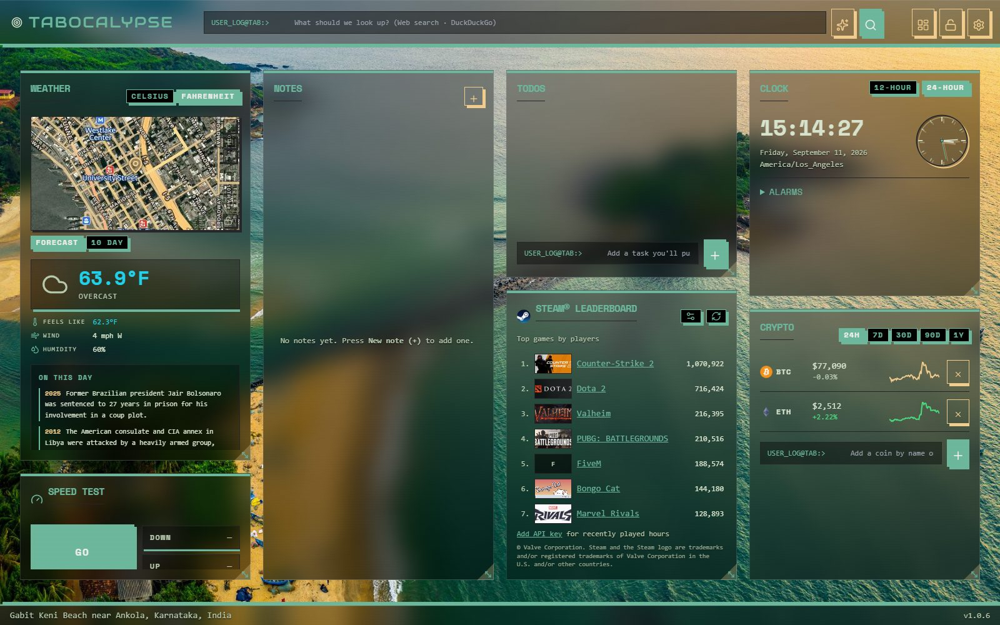                                | `hud-focus.jpg`                     | Productivity audience, "quiet mode" proof |
|                                 | `hud-light.jpg`                     | Light-mode proof, theme teaser            |
| 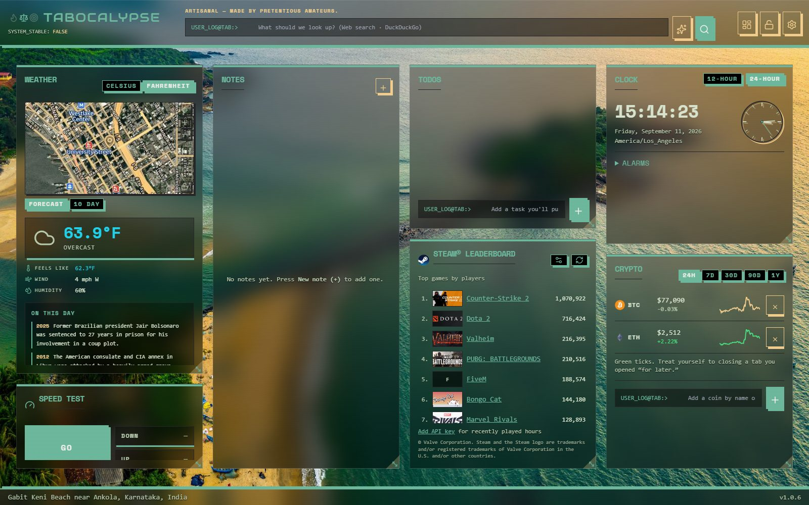      | `hud-more-widgets.jpg`              | "Fourteen widgets" claim                  |
| 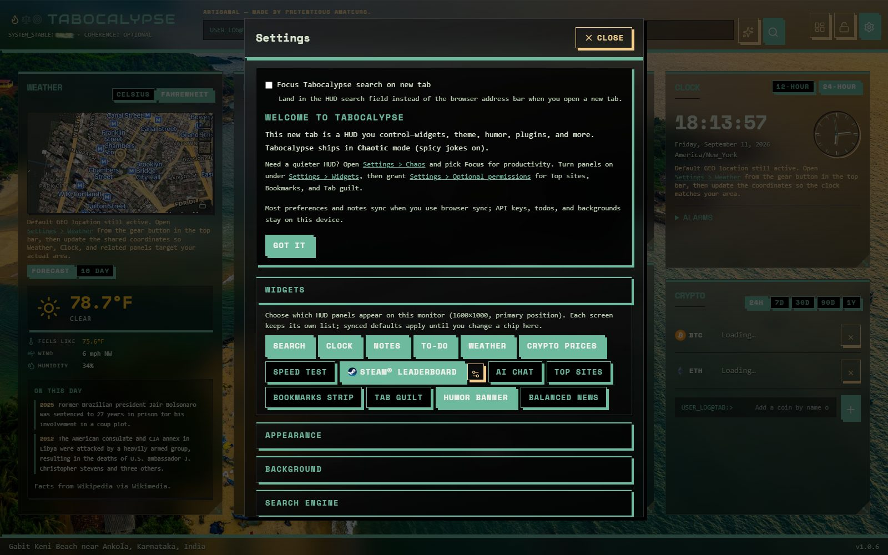                | `first-run-welcome.jpg`             | Onboarding story, store screenshot #5     |
|                   | `settings-widgets.png`              | Per-monitor toggles                       |
| 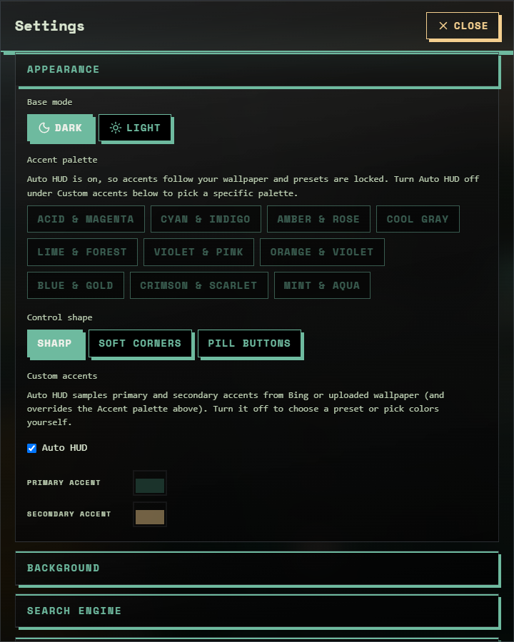            | `settings-appearance.png`           | Palettes, shapes, Auto HUD                |
|                       | `settings-chaos.png`                | Personality presets                       |
| 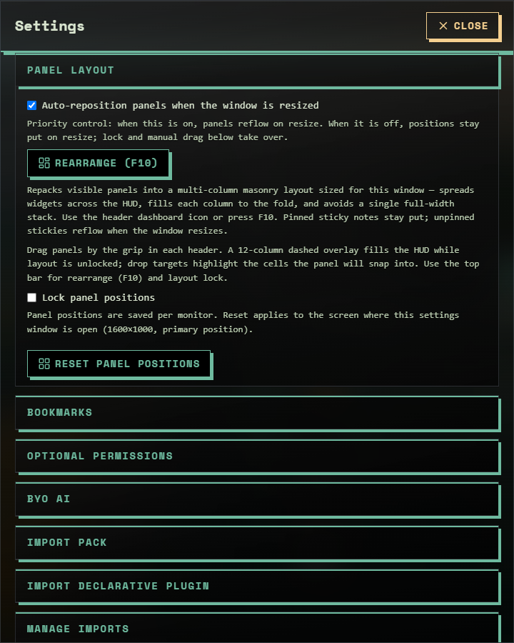        | `settings-panel-layout.png`         | Rearrange / lock / reset                  |
| 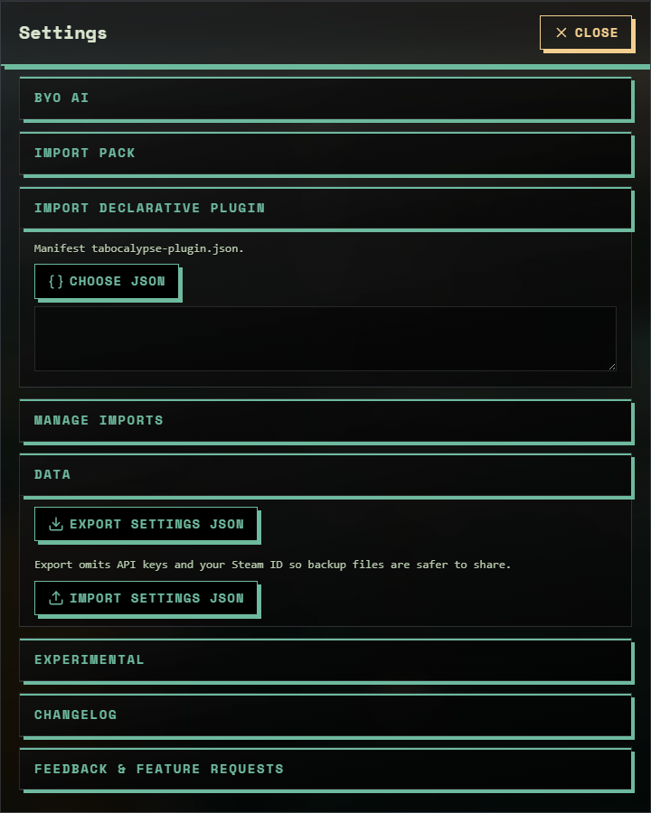                        | `settings-data.png`                 | Export / import JSON (portability claim)  |
|                | `settings-import-plugin.png`        | Creator pitch                             |
|  | `settings-optional-permissions.png` | Privacy pitch                             |
| 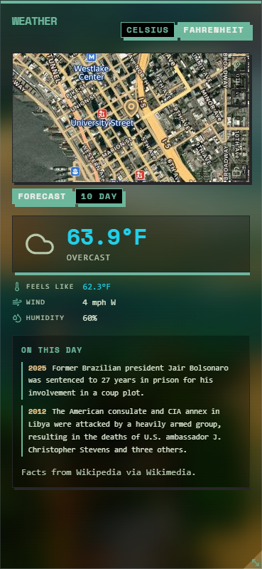                        | `panel-weather.png`                 | Feature tile                              |
| 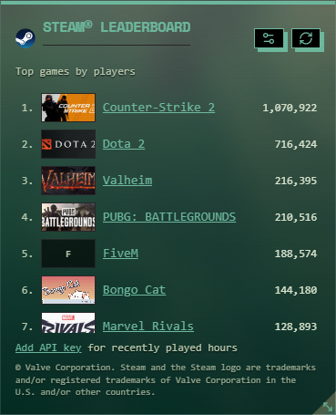    | `panel-steam-leaderboard.png`       | Gamer audience                            |
| 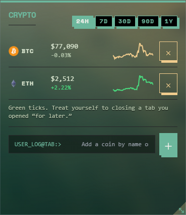                          | `panel-crypto.png`                  | Feature tile                              |
| 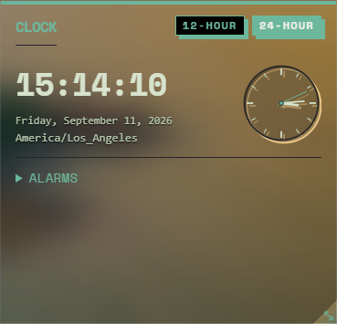                            | `panel-clock.png`                   | Alarms story                              |

Also in the kit: `panel-todo.png`, `panel-notes.png`, `panel-speed-test.png`, the icon set under `apps/extension/public/icon/`, and `site/assets/icon-128.png`. Balanced news is captured by hand when its feed is up (the script skips it so an outage never lands in the docs).

**Still to produce (manually):** a 20-second GIF (drag → F10 → Chaotic → Focus), a 1280×800 store banner with the tagline, and a branded Brand-Kit mock once the `brand` block exists.

### 🏷️ Store copy (short)

> Replace your new tab with widgets, humor packs, and optional imports — local-first, no publisher backend, no ads.

Longer variants and permission justifications: [`STORE-LISTING.md`](../STORE-LISTING.md).

---

## 💡 8. Content idea bank (use when there is something to say)

- "We read our own manifest so you don't have to" — walk through every host permission.
- "How Tabocalypse syncs notes without a server" — the per-note sync item story ([ADR-0008](../ADR/ADR-0008-SETTINGS-PERSISTENCE-SYNC-AND-LOCAL.md)).
- "Why we said no to affiliate crypto buttons" — the monetization spectrum, publicly.
- "Selling a theme as a signed JSON file" — creator tutorial once the engine ships.
- "Designing a rude UI that isn't cruel" — the glitch-core tone guide.
- Setup-tour collabs: send a build to YouTubers who do desktop/browser tours; no payment, no script.

---

## 📏 9. Measuring without telemetry

| Signal                     | Source                                        | Why it is enough                                |
| -------------------------- | --------------------------------------------- | ----------------------------------------------- |
| Installs, ratings, reviews | Store dashboards                              | Vendor-side, no code in the extension           |
| Stars, forks, issues, PRs  | GitHub Insights                               | Developer traction and contributor health       |
| Sales, refunds             | Lemon Squeezy (when Pro/suites exist)         | Merchant-side; no purchase data reaches the app |
| Donations                  | Sponsors / Ko-fi / Patreon dashboards         | Same                                            |
| Qualitative                | Store reviews, GitHub issues, mailto feedback | The only "analytics" we run is reading them     |

No site analytics, no UTM parameters on our own links (the theme importer rejects them anyway), no install pings.

---

## ❓ 10. Objections and answers

| Objection                             | Answer                                                                                                                    |
| ------------------------------------- | ------------------------------------------------------------------------------------------------------------------------- |
| "Nineteen host permissions is a lot." | Each is a public, keyless endpoint for a widget you can turn off; none are ours. Table in the listing and privacy policy. |
| "The jokes will offend someone."      | Balanced is the default in screenshots; Focus turns humor off entirely; packs are filtered and user-controlled.           |
| "Signed JSON is not DRM."             | Correct, and we say so (honesty clause). You pay for provenance and convenience, not a lock.                              |
| "How do I know it never phones home?" | AGPL source, reproducible builds via GitHub Releases, and the Firefox sources zip reviewed by Mozilla.                    |
| "Will Pro take features away?"        | Never. Pro gates new things only ([ADR-0016](../ADR/ADR-0016-MONETIZATION-ONE-OFF-LINK-OUT-NO-ADS.md)).                   |
| "Is there a roadmap date for X?"      | No dates, by policy. The board shows priority order; things ship when ready.                                              |

---

## ✅ 11. Ownership and next actions

| Action                                         | Depends on                 | Board id                      |
| ---------------------------------------------- | -------------------------- | ----------------------------- |
| Finalize store copy per portal                 | —                          | PM-T015                       |
| Recapture screenshots from the release build   | `pnpm build:chrome`        | —                             |
| Record the 20 s GIF                            | Release build              | —                             |
| Confirm supporter handles and crypto addresses | Maintainer                 | PM-T072 (done) / support page |
| Show HN + first Reddit post                    | Chrome listing live        | PM-T010                       |
| Product Hunt launch                            | Edge + Firefox live        | PM-T011, PM-T012              |
| Creator invitations                            | Theme engine               | PM-T080, PM-T087              |
| Brand Kit outreach                             | Entitlements + brand block | PM-T074, PM-T085              |

Everything above is optional in timing and mandatory in honesty.
