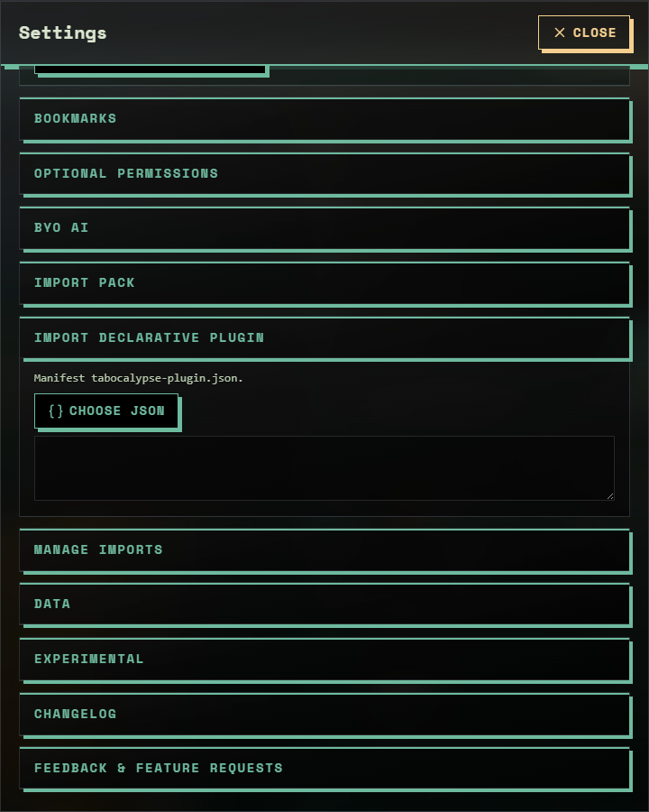

# Tabocalypse declarative plugin schema (v1)

**Documentation index:** [`README.md`](README.md) (folder `doc/`)

Plugins are **JSON only** — no user JavaScript ([ADR-0002](ADR/ADR-0002-DECLARATIVE-PLUGINS-ONLY.md)). Validation lives in **`@tabocalypse/plugin-sdk`** (`packages/plugin-sdk`, MIT); the extension imports it and renders allowlisted widget types. Import your file under **Settings › Import declarative plugin**; manage or remove it under **Settings › Manage imports**.

<p align="center"></p>

## Root object

| Field                  | Type               | Required                     |
| ---------------------- | ------------------ | ---------------------------- |
| `schemaVersion`        | `1`                | yes                          |
| `id`                   | string             | yes (alphanumeric, `_`, `-`) |
| `name`                 | string             | yes                          |
| `version`              | string             | yes                          |
| `author`               | string             | no                           |
| `description`          | string             | no                           |
| `permissionsRequested` | `[]` or `["none"]` | no                           |
| `widgets`              | array              | yes                          |

## Widgets

Each widget:

```json
{
  "id": "uniqueWithinPlugin",
  "type": "StaticText | RotatingQuotes | LinkGrid",
  "props": {}
}
```

### `StaticText`

```json
{
  "id": "hello",
  "type": "StaticText",
  "props": { "text": "Hello from my plugin." }
}
```

### `RotatingQuotes`

```json
{
  "id": "quotes",
  "type": "RotatingQuotes",
  "props": { "quotes": ["Line one", "Line two"] }
}
```

### `LinkGrid`

Links must be **`https://`**; any other scheme (including `http://`) is dropped silently during validation.

```json
{
  "id": "links",
  "type": "LinkGrid",
  "props": {
    "links": [{ "label": "Docs", "url": "https://example.com" }]
  }
}
```

## Limits and normalization

The validator (`packages/plugin-sdk/src/validate.ts`) trims and caps every field so a malformed file cannot break the HUD. Anything outside these limits is truncated or dropped, and the importer reports what it dropped.

| Field                         | Rule                                                                            |
| ----------------------------- | ------------------------------------------------------------------------------- |
| `id` (plugin and widget)      | Sanitized to `[a-zA-Z0-9_-]`, at most 64 characters                             |
| `name` / `author`             | At most 120 characters                                                          |
| `version`                     | At most 32 characters                                                           |
| `permissionsRequested`        | Must be `[]` or `["none"]`; anything else is an error                           |
| `widgets`                     | Required; an empty array is a warning, not an error                             |
| `StaticText.props.text`       | At most 2000 characters                                                         |
| `RotatingQuotes.props.quotes` | At most 100 quotes, each at most 500 characters                                 |
| `LinkGrid.props.links`        | At most 30 links; `label` ≤ 120 characters, `url` ≤ 2000 characters, HTTPS only |

The extension re-runs validation when it loads stored plugins and drops widgets that no longer validate instead of crashing.

## Reward widgets

The **Daily quiz** widget earns device-local XP, and **Settings › Rewards** spends it on a small bundled catalog of reward widgets (`apps/extension/lib/rewards/reward-catalog.ts`). Each reward is an ordinary v1 manifest as described above, bundled inside the extension with an id that starts with `reward-`, and installing one goes through the same validator and `importedPlugins` storage as a file import. Rewards appear under **Manage imports › Reward widgets**, can be disabled or removed like any plugin, and reinstall free once unlocked. The XP gate is a local game mechanic, not a license or DRM: the catalog is open source and the ledger never leaves the device. When the signed-pack envelope below ships, reward manifests become its `payload` without changing the unlock flow.

## Planned: theme packs and signed envelopes

`kind: "theme"` packs, the signed-pack envelope (`tabocalypse-signed-pack/1`), and premium declarative widget types (`DataCard`, `Countdown`, `RssList`, `StatChart`) are **planned, not shipped**. Their design lives in [`PLAN/THEME-SUITES.md`](PLAN/THEME-SUITES.md) and [`PLAN/MONETIZATION.md`](PLAN/MONETIZATION.md) ([ADR-0017](ADR/ADR-0017-THEME-SUITES-AND-BRAND-KITS-AS-SIGNED-JSON.md)). Until they land, the v1 schema above is the only thing the importer accepts.

## Content policy (applies to every plugin, pack, and theme)

- **No advertising.** Plugins must not carry ads of any kind: no affiliate links, sponsored links or images, partner placements, promotional `RotatingQuotes`, or tracking parameters on `LinkGrid` URLs. This mirrors the Tabocalypse product invariant in `.cursor/rules/project-conventions.mdc` and applies to first-party and third-party content alike. The importer may add automated checks (for example rejecting known affiliate URL patterns) as the schema grows.
- **You may sell your plugin.** Creators are welcome to sell plugins, packs, and themes as **signed JSON** on their own merchant pages (Gumroad, Lemon Squeezy, Ko-fi shop, and so on). Tabocalypse takes no cut, runs no review queue, and does not sign third-party content; the signed envelope carries your own public key and the extension shows the signer to the user. See [`PLAN/MONETIZATION.md`](PLAN/MONETIZATION.md) for the envelope format and the honesty clause (signed JSON is provenance, not DRM).
- **Declarative only, always.** Selling a plugin does not change the rules: JSON only, allowlisted widget types, HTTPS links, no user JavaScript.

## Distribution

Share a single **`.json`** file; the plugin importer accepts only `.json`. (ZIP import is for **humor packs** — a `pack.json` inside the archive — under **Settings › Import pack**, see [`examples/`](../examples/README.md).) Creators may sell plugins on their own pages; see the content policy below.

## Examples

See [`packages/example-plugin/tabocalypse-plugin.json`](../packages/example-plugin/tabocalypse-plugin.json).
